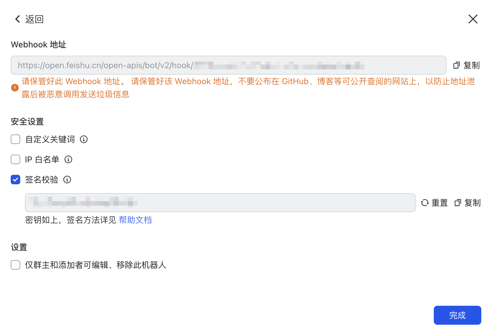
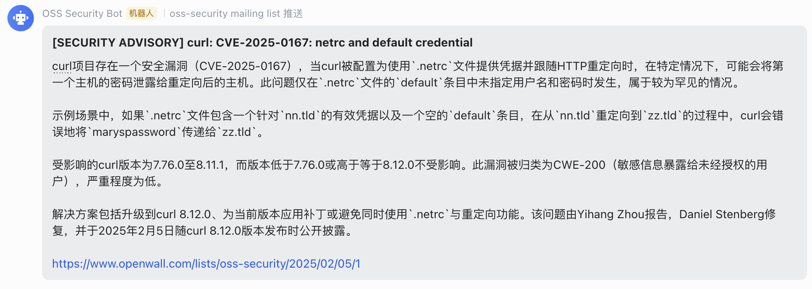
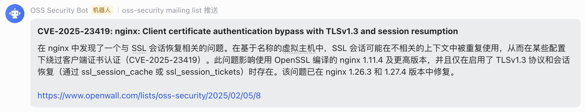

# OSS Security Bot

[oss-security](https://www.openwall.com/lists/oss-security/) 飞书推送机器人, 基于 Rust 编写 🦀

使用 LLM 对邮件内容进行摘要总结 (Summarize)

## 配置

程序初次运行时会生成 `Config.toml`

```toml
[mail]
interval = 60 # 爬取 mailing list 的时间间隔 (单位为秒)
# filters = ["Apache", "Linux"] # 对邮件标题 (Subject) 进行过滤, 如果不包含其中任一关键词则不会被推送

[bot]
access_token = "<LARK_ACCESS_TOKEN>" # https://open.feishu.cn/open-apis/bot/v2/hook/ 后面的即为 Token
secret_key = "<LARK_SECRET_KEY>" # 用于签名校验的密钥

[llm]
base_url = "<BASE_URL>" # LLM URL (OpenAI API 规范)
api_key = "<API_KEY>" # LLM API KEY
model = "<MODEL>" # LLM Model Name

system = "你是一名经验丰富的网络安全研究员 (Security Researcher)" # System Prompt
user = '''请结合以下要求总结文本:
1. 使用中文输出总结后的内容
2. 仅总结邮件正文部分, 忽略邮件的 Metadata 信息
3. 仅需输出总结后的内容

待总结的文本如下:
{TEXT}''' # User Prompt, {TEXT} 表示邮件内容
```

按照要求配置飞书 Webhook 机器人以及 LLM API (兼容 OpenAI 规范)



## 使用



