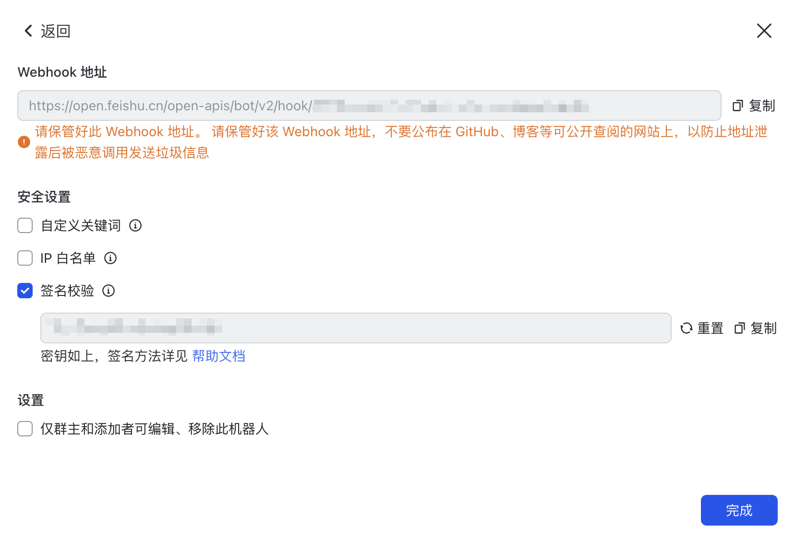
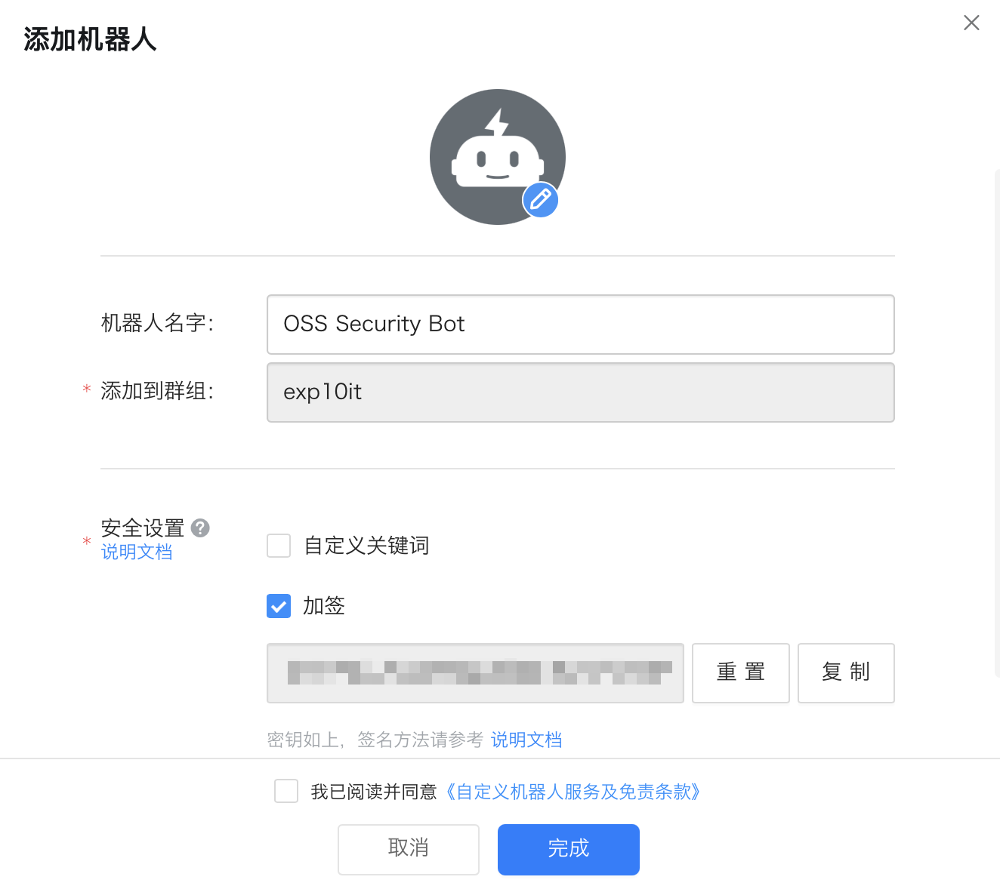
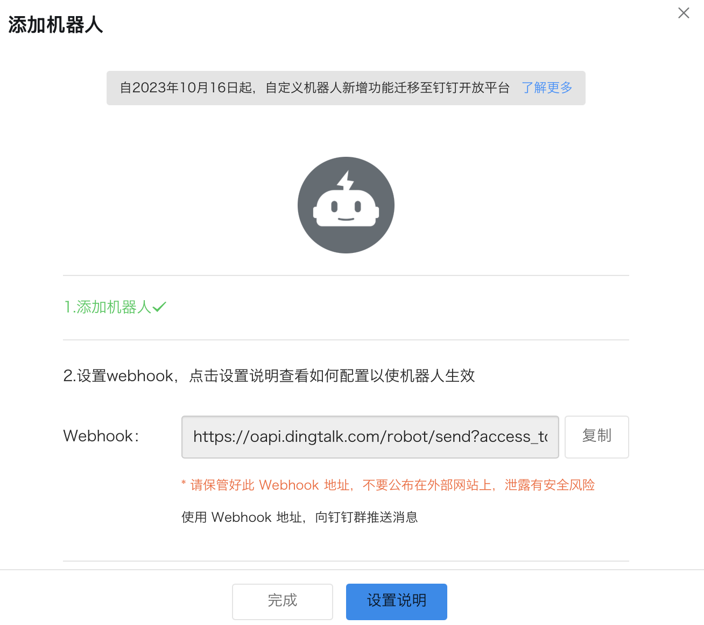
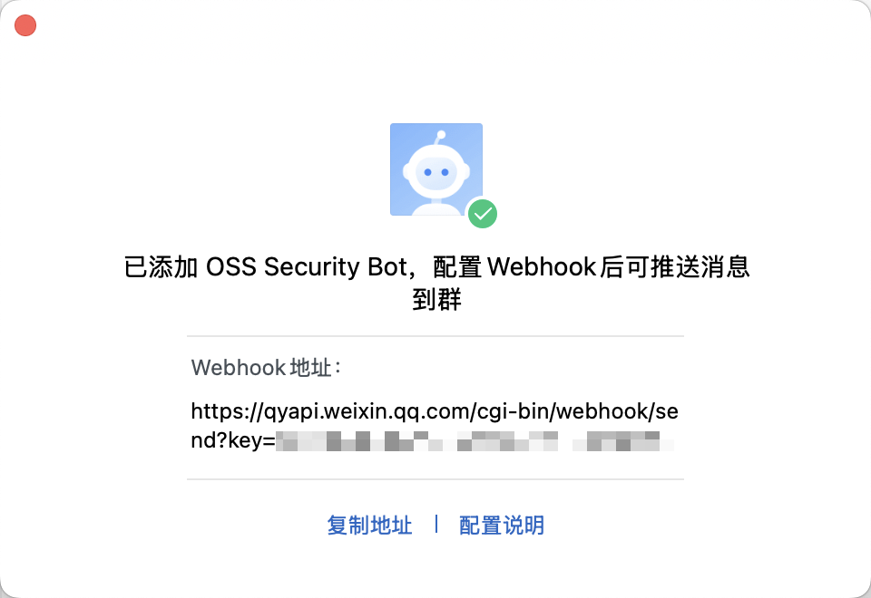
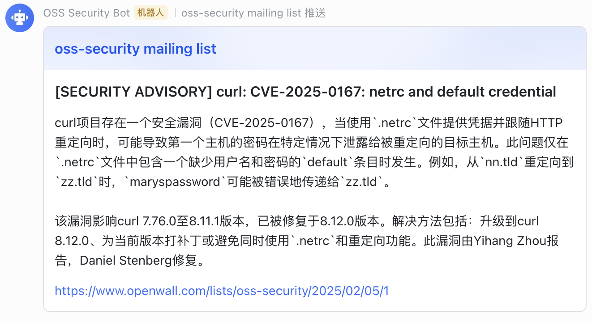
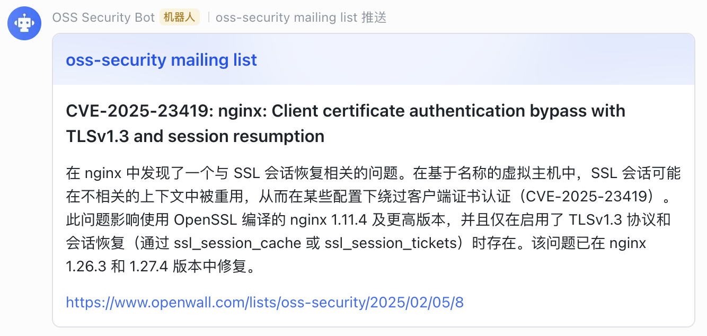
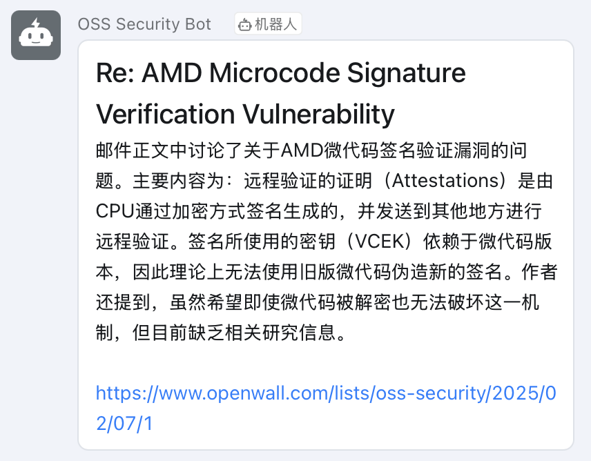
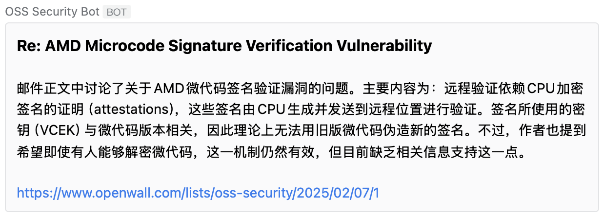

# OSS Security Bot

[oss-security](https://www.openwall.com/lists/oss-security/) Webhook 推送机器人, 基于 Rust 编写 🦀

使用 LLM 对邮件内容进行摘要总结 (Summarize)

支持飞书, 钉钉和企业微信

## 配置

程序初次运行时会生成 `Config.toml`

```toml
[mail]
interval = 60 # 爬取 mailing list 的时间间隔 (单位为秒)
# filters = ["Apache", "Linux"] # 对邮件标题 (Subject) 进行过滤, 如果不包含其中任一关键词则不会被推送

[bot]
type = "lark"                        # 机器人类型, 目前支持飞书 (lark), 钉钉 (dingtalk) 和企业微信 (wechat)
access_token = "<LARK_ACCESS_TOKEN>" # Webhook 机器人 Token
secret_key = "<LARK_SECRET_KEY>"     # 用于签名校验的密钥

[llm]
base_url = "<BASE_URL>" # LLM URL (OpenAI API 规范)
api_key = "<API_KEY>"   # LLM API KEY
model = "<MODEL>"       # LLM Model Name

system = "你是一名经验丰富的网络安全研究员 (Security Researcher)" # System Prompt
user = '''请结合以下要求总结文本:
1. 使用中文输出总结后的内容
2. 仅总结邮件正文部分, 忽略邮件的 Metadata 信息
3. 仅需输出总结后的内容

待总结的文本如下:
{TEXT}''' # User Prompt, {TEXT} 表示邮件内容
```

### 飞书

`https://open.feishu.cn/open-apis/bot/v2/hook/` 后面的内容为 Access Token

需要配置签名校验, 密钥即为 Secret Key



### 钉钉

勾选加签, 密钥即为 Secret Key



`https://oapi.dingtalk.com/robot/send?access_token=` 后面的内容为 Access Token



### 企业微信

`https://qyapi.weixin.qq.com/cgi-bin/webhook/send?key=` 后面的内容为 Access Token

企业微信的 Webhook 机器人不支持签名校验, 无需填写 Secret Key



## 使用

程序刚开始运行时默认会推送当天的邮件

**飞书**





**钉钉**



**企业微信**


